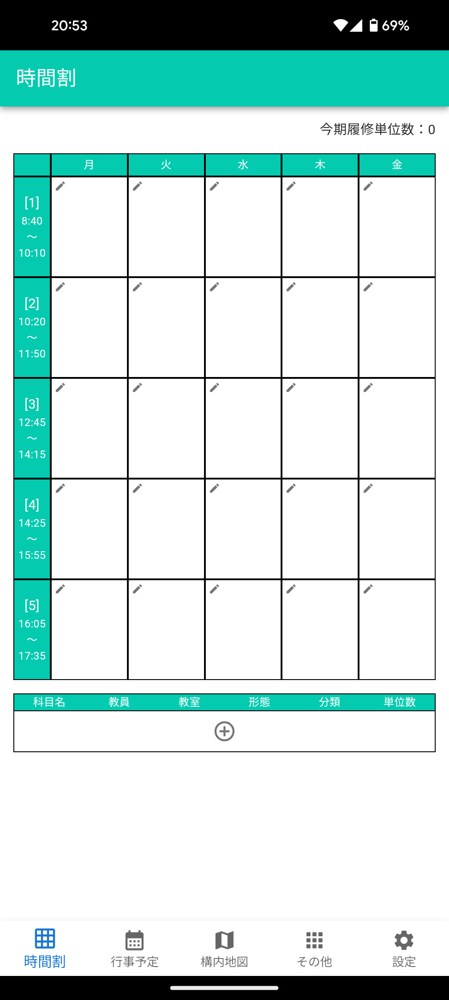

# react-gakujo

## 機能

-   時間割
-   行事予定
-   構内地図
-   工学部ガイド
-   その他

    -   学務情報システムショートカット
    -   教務システムショートカット
    -   OPAC ショートカット
    -   学生便覧ショートカット
    -   卒業年度チェック
    -   六間坂上時刻表
    -   授業時間タイマー
    -   静岡大学公式サイトショートカット
    -   生協（浜松 X）ショートカット
    -   Wi-Fi 設定ガイド
    -   メール設定ガイド
    -   学籍番号
    -   さわやか和合店待ち時間ショートカット
    -   設定データコピーショートカット

## インストール

https://tsuyopon-1067.github.io/react-gakujo/

## 環境

-   Node.js v20.10.0
-   React.js v18.2.0
-   TypeScript v5.3.3
-   MUI v5.15.11
-   vite v5.1.4
