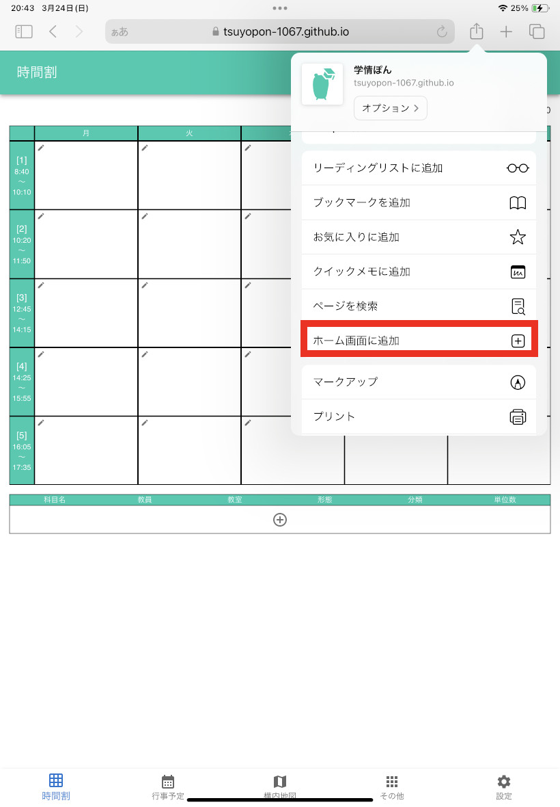
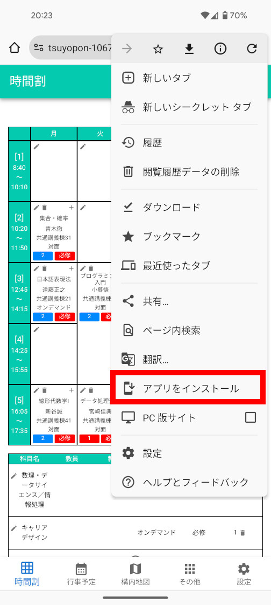
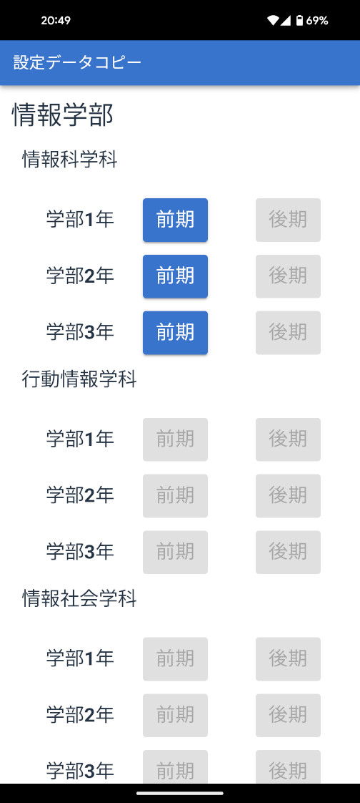

# 学情ぽん

静岡大学（主に浜松キャンパス）向けのいろいろできるアプリです．

## インストール

[こちら](https://tsuyopon-1067.github.io/react-gakujo/)からインストール可能．

### iOS

ブラウザ（Safari 推奨）でこの[URL](https://tsuyopon-1067.github.io/react-gakujo/)にアクセスし，メニューから「ホーム画面に追加」を選択し，追加ボタンを選択．

### Android

ブラウザ（Chrome 推奨）でこの[URL](https://tsuyopon-1067.github.io/react-gakujo/)にアクセスし，メニューからインストール．

## 設定サンプル

ボタンを押すと設定データがクリップボードに保存される．その後設定画面で設定データを貼り付けて「設定をインポート」ボタンを押せば設定が適用される．

設定サンプルは後日いろいろ追加予定．

## 機能

### 時間割

ペンのアイコンから授業を追加可能．

#### 連続

実験等の複数コマにまたがる授業はこの値を連続するコマ数にする．通常は 1 で OK．

### 行事予定

公式で公開されている情報に準拠．

### 構内地図

#### 工学部ガイド

オンにすることで工学部棟を結ぶ矢印でを表示．

### その他

#### 学務情報システム・教務システム・OPAC・学生便覧・静岡大学公式サイト・生協（浜松 X）・さわやか和合店待ち時間・設定データコピー

それぞれ対応する Web サイトへのショートカット

#### 卒業年度チェック

小学校・中学校・高校・大学・大学院の入学・卒業年度を算出する．

#### 六間坂上時刻表

六間坂上時刻表浜松駅方面の時刻表．路線図付き．

#### 授業時間タイマー

各コマの授業・休み時間の進捗と終わるまでの時間を表示．

#### 学籍番号

学籍番号を入力して所属等を表示．各桁の意味も見れる．

#### Wi-Fi・メール

Wi-Fi とメールの設定ガイド

### 設定

#### 設定をインポート

サンプル設定データや他の人からもらったデータを貼り付けてから「設定をインポート」ボタンを押せば設定が適用される．

#### 設定をクリップボードにコピー

設定データを他人に共有する．ボタンを押すと設定データはクリップボードに保存され，好きなところに貼り付けられる．

#### カラー設定

テーマカラーとフォントカラーを設定可能．
